  

<b>I build web systems, ship them to production and keep them running.</b>

  
  
  
  

---

### 👋 About

Systems Engineer (UMSS, Bolivia) working remotely for clients in Germany. My work sits where development meets operations: I build **Angular** applications, customize **WordPress** platforms with **PHP and JavaScript**, and take care of **deployments, SSL, caching and incident response** on Linux servers. I use **AI coding agents** as part of a controlled, evidence-based workflow.

- 🏢 **Currently:** Web Systems Engineer at **pirAMide Informatik GmbH** (Hamburg · remote, 2024 – present)
- 🧪 **Research:** author of [Debugging for Instances (DFI)](https://github.com/OmarArgenes/debugging-for-instances), an evidence-based method for AI-assisted debugging ([DOI](https://doi.org/10.5281/zenodo.22986103))
- 🌎 Cochabamba, Bolivia · UTC-4 · Spanish (native), English (B1)

---

### 🅰️ Angular

I have worked with Angular 17, 19 and 22 across company and personal projects.

| | |
|---|---|
| **Architecture** | Standalone components · zoneless change detection · domain-oriented folder structure · route-level lazy loading · route guards |
| **Rendering** | Server-side rendering and prerendering with `@angular/ssr` |
| **Design systems** | Shared UI libraries built with `ng-packagr` · SCSS design tokens · responsive layouts |
| **Quality** | TypeScript strict mode · Vitest · Prettier · accessibility targets (WCAG 2.2 AA) · Core Web Vitals targets |
| **Data** | RxJS services · REST APIs · Supabase (PostgreSQL + Auth) |
| **UI libraries** | PrimeNG · PrimeFlex · Bootstrap |
| **i18n** | ngx-translate — multilingual interfaces and language selectors |

---

### 🤖 AI-assisted engineering

> *AI proposes. Evidence decides. The engineer controls.* — core principle of DFI

- **AI coding agents in real repositories**, guided by repository-level instructions (`AGENTS.md`, `CLAUDE.md`) and written AI guidelines that define what an agent may and may not change.
- **Angular CLI MCP server** connected to the agent, so it works with the project's real tooling instead of guessing.
- **Evidence-based debugging with AI** — hypotheses are tested against what the system actually does before any fix is applied. I formalized this approach as [DFI](https://github.com/OmarArgenes/debugging-for-instances).
- **Human review stays in charge:** small changes, feature branches and verification after every change.

---

### 🏢 Current work at pirAMide Informatik

> Source code for this work is private because it belongs to my employer and its clients.
> Each project below links to a showcase repository with scope, architecture and my role — no source code. More write-ups: **[engineering-case-studies](https://github.com/OmarArgenes/engineering-case-studies)**.

| Area | What I do | Stack |
|---|---|---|
| **[Angular migration](https://github.com/OmarArgenes/piramide-angular-migration-showcase)** | Migrating a corporate website to a modern Angular application, preserving public URLs and visual baseline while improving maintainability, performance, accessibility and SEO | Angular 22 · SSR · TypeScript · SCSS · Vitest |
| **[Modern website redesign](https://github.com/OmarArgenes/piramide-modern-website-showcase)** | Redesign work: design system with tokens, responsive layouts, documented quality standards | Angular · TypeScript · SCSS |
| **[Business Manager platform](https://github.com/OmarArgenes/bm-platform-showcase)** | Product website, shared UI library and CRM interface concept for the company's business-management platform | Angular · SSR · ng-packagr |
| **WordPress development & operations** | Development, maintenance and support of **15+ client websites and web apps** across staging and production | WordPress · WooCommerce · BuddyBoss · LearnDash · PHP · JS |
| **Web operations** | Staging → production deployments, backups, SSL, caching, permissions and production incident resolution | Debian · Plesk · Nginx · PHP-FPM |

---

### 🤝 Verified contributions to team repositories

> Source code remains in the official repositories. Everything below links to public, merged pull requests — no code is redistributed here.

#### pirAMide Informatik GmbH — IWS Manager
[`Piramide-Informatik/iws-manager-webapp`](https://github.com/Piramide-Informatik/iws-manager-webapp) · **22 merged pull requests** · March – June 2025

Enterprise management web application. I built CRUD screens, data tables and navigation for the frontend.

**Stack:** Angular 19 · TypeScript · PrimeNG · Reactive Forms · ngx-translate · PrimeFlex

**What I worked on:** 10 master-data screens (users, roles, absence types, holidays, funding programs, IWS staff, commissions, teams, countries, costs) · work contracts, invoices and subcontracts modules · data tables with sorting, pagination, column filters and multiselect filters · form validation · multilingual UI and language selector · grouped master-data navigation menu

| PR | Contribution |
|---|---|
| [#16](https://github.com/Piramide-Informatik/iws-manager-webapp/pull/16) | Work contracts table — PrimeNG table with sorting, global filter and dialogs |
| [#26](https://github.com/Piramide-Informatik/iws-manager-webapp/pull/26) | Translation support and language selector (ngx-translate) |
| [#47](https://github.com/Piramide-Informatik/iws-manager-webapp/pull/47) | Invoices table and improved language selection panel |
| [#55](https://github.com/Piramide-Informatik/iws-manager-webapp/pull/55) | Subcontracting details — Reactive Forms with validation and related tables |
| [#95](https://github.com/Piramide-Informatik/iws-manager-webapp/pull/95) | Grouped master-data navigation menu |
| [#101](https://github.com/Piramide-Informatik/iws-manager-webapp/pull/101) | User management UI |
| [#139](https://github.com/Piramide-Informatik/iws-manager-webapp/pull/139) | Funding programs UI |
| [#155](https://github.com/Piramide-Informatik/iws-manager-webapp/pull/155) | IWS staff UI |
| [#179](https://github.com/Piramide-Informatik/iws-manager-webapp/pull/179) | Countries, costs, teams and commissions screens |
| [#396](https://github.com/Piramide-Informatik/iws-manager-webapp/pull/396) | Scrolling fix applied across all data tables |

#### LabDev INFSIS (UMSS) — Social platform
Team project of the Department of Informatics and Systems, Universidad Mayor de San Simón · November 2024 – May 2025

**Frontend** · [`pagina-web-social-frontend`](https://github.com/labdev-infsis/pagina-web-social-frontend) · **8 merged PRs** · Angular 17 · TypeScript · Bootstrap

| PR | Contribution |
|---|---|
| [#21](https://github.com/labdev-infsis/pagina-web-social-frontend/pull/21) | Commenting on posts |
| [#33](https://github.com/labdev-infsis/pagina-web-social-frontend/pull/33) | Emoji reactions on comments |
| [#50](https://github.com/labdev-infsis/pagina-web-social-frontend/pull/50) | Replies UX — descending order, auto-focus on reply, show more / show less, consistent date format |
| [#53](https://github.com/labdev-infsis/pagina-web-social-frontend/pull/53) | Replying to comments, including nested replies |
| [#55](https://github.com/labdev-infsis/pagina-web-social-frontend/pull/55) | Reactions component and refactor of comments and replies |

**Backend** · [`pagina-web-social-backend`](https://github.com/labdev-infsis/pagina-web-social-backend) · **6 merged PRs** · Java 17 · Spring Boot 3 · Spring Data JPA

| PR | Contribution |
|---|---|
| [#23](https://github.com/labdev-infsis/pagina-web-social-backend/pull/23) | Search posts by text — controller, service, repository query, DTO and mapper |
| [#60](https://github.com/labdev-infsis/pagina-web-social-backend/pull/60) | Paginated post listing in batches of 10 (`Pageable`) |
| [#62](https://github.com/labdev-infsis/pagina-web-social-backend/pull/62) | Posts ordered by date with pagination |
| [#66](https://github.com/labdev-infsis/pagina-web-social-backend/pull/66) | Nested replies — self-referencing JPA relationship, JPQL query for top-level replies and reply-tree building |
| [#68](https://github.com/labdev-infsis/pagina-web-social-backend/pull/68) | Emoji reactions on replies — controller, service, repository, DTOs and mappers |

---

### ⭐ Featured projects

| Project | Description | Stack | Links |
|---|---|---|---|
| **[Debugging for Instances (DFI)](https://github.com/OmarArgenes/debugging-for-instances)** | Methodological framework for AI-assisted, evidence-based software diagnosis — falsifiable hypotheses, controlled instrumentation and verified fixes | Methodology · JSON Schema · JS | [Paper (Zenodo)](https://zenodo.org/records/22986103) |
| **[Engineering Case Studies](https://github.com/OmarArgenes/engineering-case-studies)** | Public-safe write-ups of professional work: Angular migration, design systems, B2B product frontend and a production incident | Angular · SSR · PHP-FPM | — |
| **[Personal Portfolio](https://github.com/OmarArgenes/portfolio-showcase)** | Bilingual portfolio hand-built with a WebGL aurora background, a 3D globe on canvas and animated SVG diagrams | HTML · CSS · Vanilla JS · WebGL | [Live](https://omar-argenes.netlify.app/) |
| **[Automotive Workshop System](https://github.com/OmarArgenes/mecanica-automotriz-web)** | Management system for an automotive repair shop: customers, vehicles, intake inspection, work orders, parts requests and printable documents | Angular 19 · TypeScript · Supabase · PostgreSQL · Netlify | [Live](https://zcanedo.netlify.app/) |

---

### 🧰 Skills

**Frontend** &nbsp;

**Backend & data** &nbsp;

**WordPress ecosystem** &nbsp;

 WooCommerce Memberships & Subscriptions · BuddyBoss · LearnDash · Modern Events Calendar · WP Job Manager · custom themes, plugins, shortcodes, forms, roles & permissions

**Operations** &nbsp;

 Staging → production · DNS · SSL · backups · caching · PHP-FPM / OPcache · file permissions · post-deployment QA

**AI & methods** &nbsp;

 Prompt engineering · root cause analysis · Scrum · OKR · Design Thinking

**IT foundations:** 10+ years of hardware, software and network support — Windows/Linux, LAN/Wi-Fi, routers, peripherals, data recovery, malware removal and end-user support.

**Working knowledge:** React · Node.js · Laravel · Docker · Python · Power BI

---

### 🔎 How I work

- **Evidence before fixes.** I debug by forming hypotheses and testing them against what the system actually does.
- **Production is part of the job.** Backups before changes, staging before production, verification after every deployment.
- **Small, reviewable changes.** Feature branches, pull requests and descriptive commits.
- **Documentation first.** Architecture, standards and decisions are written down before implementation starts.

---

  Open to remote roles · <a href="https://omar-argenes.netlify.app/">omar-argenes.netlify.app</a>

